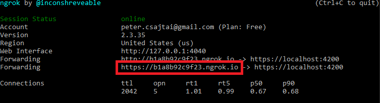

# ConfigCat Feature Flags Monday App

Turn features On / Off right from an Item on your Monday.com dashboard. Also you can add Targeting or Percentage Rules just as easily.

## About ConfigCat

Manage features and change your software configuration using [ConfigCat feature flags](https://configcat.com), without the need to re-deploy code. A [10 minute trainable Dashboard](https://app.configcat.com) allows even non-technical team members to manage features directly. Deploy anytime, release when confident. Target a specific group of users first with new ideas. Supports A/B/n testing and soft launching. Provides [open-source SDKs](https://github.com/configcat) for easy integration with any web, mobile or backend application.

## Installation


1. Install ConfigCat Feature Flags app in your Monday.com account.
2. Add ConfigCat Feature Flags to a dashboard item
3. Get your ConfigCat Public API credentials: https://app.configcat.com/my-account/public-api-credentials
4. Click authorize.

## Usage


1. Open any Item on your Monday.com board.
2. Push `Link existing feature flag`
3. Select a Product, Config, Environment and a Feature Flag to be linked to your card.
4. When linked, you can turn your features On / Off right from this dashboard item.

## Run project locally
1. Install npm dependencies  
   ```
   npm install
   ```
1. Start the angular project
   ```
   npm start
   ```
1. Expose your project to the internet with **ngrok**
   ```
   ngrok http --host-header=rewrite https://localhost:4200
   ```
   You should see something like this:
   
1. Go to the developers page (https://YOUR_ORGANIZATION_NAME.monday.com/apps/manage) of your Monday account
1. Hit the `Create App` button
1. Go to the `OAuth` page and select the `boards:read` permission
1. Add a new feature
1. Select `Item Views` and hit `Let's go`
1. Select `Start from Scrach` and hit `Go To Editor`
1. Give it a name
1. Select `Widget Setup` and change the source to Published Build. Hit New Build.
1. Get your *https ngrok url* (highlighted in the 3rd step) and use it as your `Custom URL`.
1. Hit `Create build`
1. Open a board and select an item. You can add your app to the item.

## Contributions are welcome

## Need help?

https://configcat.com/support
