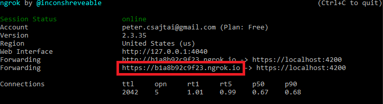

# ConfigCat Feature Flags monday.com App

The [ConfigCat Feature Flags monday app](https://monday.com/marketplace/10000079) allows you to connect your Monday items and feature flags. Create or link existing flags to your items without leaving your monday instance.

Turn features On/Off right from a linked item on your Monday board. You can also easily modify the linked flags to edit or add new Targeting or Percentage Rules.

## About ConfigCat

Manage features and change your software configuration using [ConfigCat feature flags](https://configcat.com), without the need to re-deploy code. A [10 minute trainable Dashboard](https://app.configcat.com) allows even non-technical team members to manage features directly. Deploy anytime, release when confident. Target a specific group of users first with new ideas. Supports A/B/n testing and soft launching. Provides [open-source SDKs](https://github.com/configcat) for easy integration with any web, mobile or backend application.

## Installation

1. Install [ConfigCat Feature Flags](https://monday.com/marketplace/10000079) monday.com app to your monday account.
2. Open one of your boards on monday.com and click on an Item.
3. Add the ConfigCat Feature Flags monday app to your Item.
4. To use ConfigCat Feature Flags, you must first authorize it with your ConfigCat Public API credentials.
3. Get your ConfigCat Public API credentials: https://app.configcat.com/my-account/public-api-credentials
4. Click authorize.


## Usage

### Linking existing feature flags

1. Open any item on your monday.com board.
2. Push the `Link existing feature flag`.
3. Select a Product, Config, Environment, and Feature Flag to be linked to your monday.com Item.
4. When linked, you can manage the selected feature flag from this monday.com Item.


### Creating new feature flags

1. Open any item on your monday.com board.
2. Push the `Create and link feature flag`.
3. Select a Product and Config where you want to create the feature flag.
4. Set up your feature flag.
5. Select which environment you would like to link to this Item.
6. When linked, you can manage the selected feature flag from this monday.com Item.


## Run project locally
1. Install npm dependencies  
   ```
   npm install
   ```
1. Start the angular project
   ```
   npm start
   ```
1. Expose your project to the internet with **ngrok**
   ```
   ngrok http --host-header=rewrite https://localhost:4200
   ```
   You should see something like this:
   

Follow the following steps to create a new app
1. Go to the developers page (https://YOUR_ORGANIZATION_NAME.monday.com/apps/manage) of your monday account.
1. Hit the `Create App` button.
1. Go to the `Build` > `OAuth & permissions` page and select the `boards:read` permission.
1. Go to the `Build` > `Features` page and `Create` a new feature.
1. Select `Item Views` and hit `Next`.
1. Select `Start from Scrach` and hit `Create`.
1. In `Basic Setting` Give it a name.
1. In `Deployment` select deployment type `External Hosting` and set the URL to your *https ngrok url* (highlighted in the 3rd step).
1. Hit `Save Changes`.
1. Set a feature slug in the dialog and `Save`.

Set up live install and reusable v2 Active Draft version
1. Click the `Prommote to live` button to set v1 version to live.
1. Go to the `Distribute` > `Install app` page and click the `Install` button.
1. Go to the `Manage` > `App version` page.
1. Click `New version` to create v2 Active Draft version.

Update feature URL - v2 Feature URL can be modified, the changes will be aviable for Collaborators
1. Go to the `Build` > `Features` page and select your Item View feature.
1. Select the `Deployment` and change the URL to your *https ngrok url* (highlighted in the 3rd step).
1. Hit `Save Changes`.

Add the app to a board to test
1. Click the `puzzle icon` (monday marketpalce) on the top right corner.
1. Click `Manage` and in the listed app find your local test app and open it.
1. Click the `Use app` button.
1. Chose a workspace and a board where you want to test the local app.
1. Open the previously selected board and select an item. You can add can see the app in the item view.

## Contributions are welcome

## Need help?

https://configcat.com/support
